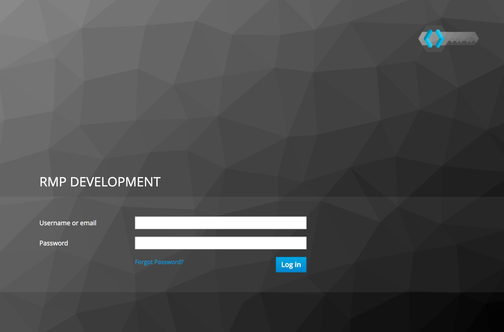
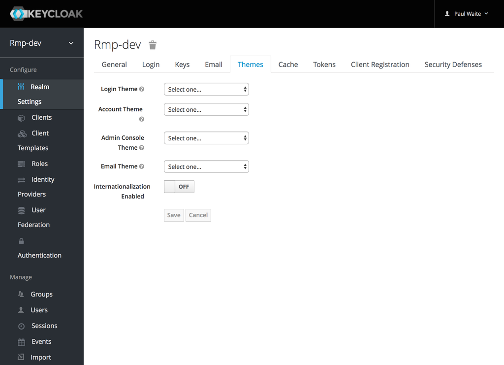
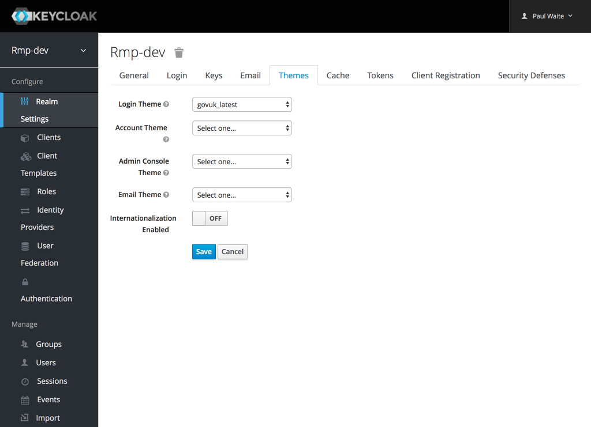
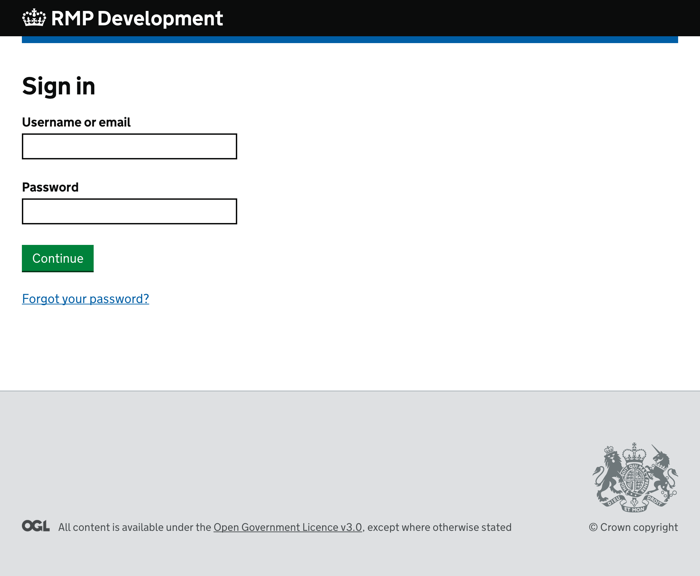
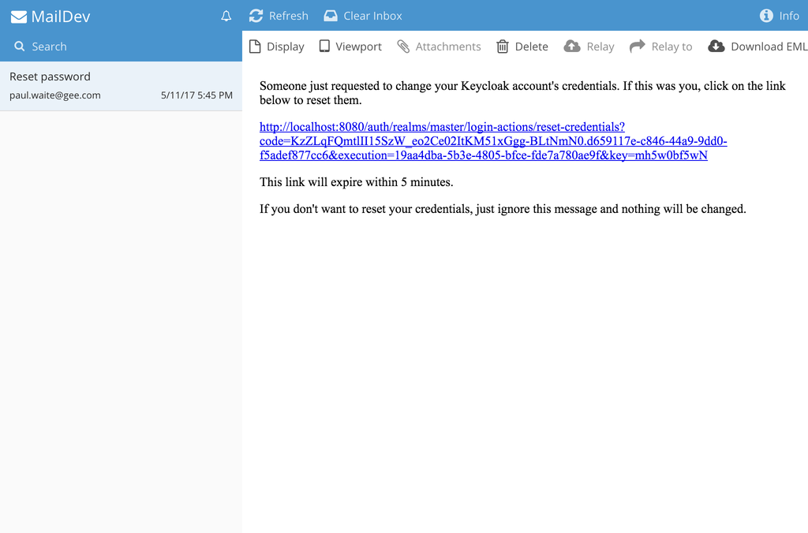

# keycloak-theme-govuk

A Keycloak theme using GOV.UK Template and Elements.

- [How to use](#how-to-use)
- [Developers](#developers)
	- [Run the Keycloak Docker container](#run-the-keycloak-docker-container)
	- [Log in to the Keycloak Docker container](#log-in-to-the-keycloak-docker-container)
	- [Use the GOV.UK theme in the Keycloak Docker container](#use-the-govuk-theme-in-the-keycloak-docker-container)
	- [View Keycloak e-mails with MailDev](#view-keycloak-e-mails-with-maildev)

## How to use

This theme has been deployed to the UK Home Office hosting platform Keycloak Docker container. To use it on your Keycloak realm:

1. Sign into your realm's admin console.

2. Go to the “Themes” tab in “Realm Settings”

3. Select “govuk_latest” as your login theme, and click on “Save”

The theme will now be used for all Keycloak log in screens on your realm - including logging in to the admin console. If you sign out, you should see the GOV.UK themed log in screen.

## Developers

To make it easier to test changes to the theme, this project includes a Docker container that provides a Keycloak instance with the theme available to it, and a MailDev installation for testing Keycloak’s e-mails.

To run it, you’ll need to install [Docker Community Edition](https://docs.docker.com/engine/installation/).

### Run the Keycloak Docker container

1. Install Docker, and make sure it’s running.

2. Clone this repository to your computer.

3. In the root directory of the cloned repository, run this terminal command:

        docker-compose up

    This will bring up the Docker container with Keycloak and MailDev.

4. To stop the container, hit <kbd>CTRL</kbd> and <kbd>c</kbd>.

5. To destroy the container, run this terminal command:

        docker-compose down

### Log in to the Keycloak Docker container

1. Visit http://localhost:8080

    (Keycloak currently redirects this to http://localhost:8080/auth/. If you visit it too early, you may see a 404 error. You may need to do a hard refresh (Ctrl+F5) to see the actual Keycloak home page.)

2. Cick on “Administration Console”.

3. Log in using the username **admin** and the password **admin**.

### Use the GOV.UK theme in the Keycloak Docker container

1. Log in to the Keycloak Docker container.

2. Follow steps 2 and 3 in [the How to use instructions](#how-to-use) above.

### View Keycloak e-mails with MailDev

1. Log in to the Keycloak Docker container.

2. Go to the “Email” tab in “Realm Settings”

3. Enter the following details:

    - Host: **maildev**

    - From: **keycloak@keycloak**

4. Click on “Save”

5. Click on “Admin” in the top-right-hand corner of the page, and click on “Manage Account”

6. Add an e-mail address to the admin account.

    It doesn’t matter what e-mail address you add, as all e-mails will be caught by MailDev. But you do need to add one, otherwise Keycloak will not send e-mails for this account.

7. To check that the e-mail configuration is working:

    1. Click on the “Back to Security Admin Console” link

    2. Click on the “Login” tab in “Realm Settings”

    3. Enable “Forgot password”

    4. Click on “Save”

    5. Sign out.

    6. On the Keycloak log in screen, click on the “Forgot your password?” link

    7. Enter your username (**admin**) in the text field, and submit the form.

    8. Visit MailDev, at http://localhost:8081. You should see a reset password e-mail from Keycloak.

        

### TODO

- Updating Keycloak theme files

- Updating GOV.UK projects

- Updating the GOV.UK themes

